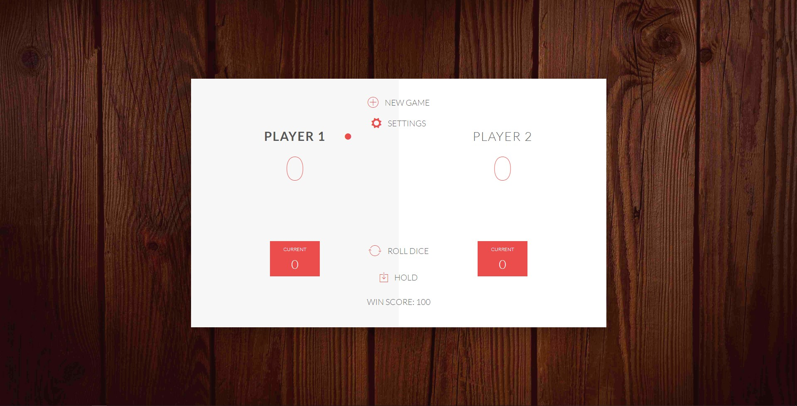

# Pig Game(Dice Game)

Welcome to the Pig Game(Dice Game) challenge/project of [The Complete Javascript Course 2020: Build Real Projects!](https://www.udemy.com/share/101WeYCUEfeVZWRng=/) Udemy course from Jonas Schmedtmann.

This Project is the challenge from above mentioned course with a bit added features. The challenge without any extra added features consists of building the game with following rules:

_GAME RULES:_

- The game has 2 players, playing in rounds.
- In each turn, a player rolls a dice as many times as he whishes. Each result get added to his ROUND score.
- BUT, if the player rolls a 1, all his ROUND score gets lost. After that, it's the next player's turn.
- The player can choose to 'Hold', which means that his ROUND score gets added to his GLOBAL score. After that, it's the next player's turn.
- The first player to reach 100 points on GLOBAL score wins the game.

### Added Features to game are:

- User can select the points to complete in order to win the game via settings option.
- User can change the players' name through settings option.
- User can see visually how much score is needed to win the game.

A new game rule has also been implemented.

- When a player rolls 6 two times in row, all his ROUND score and GLOBAL score gets lost. Then, it's next player's turn.

**Disclaimer:** Since the focus of this project is on practicing JavaScript, the game is not designed for small devices (mobiles and tablets).
